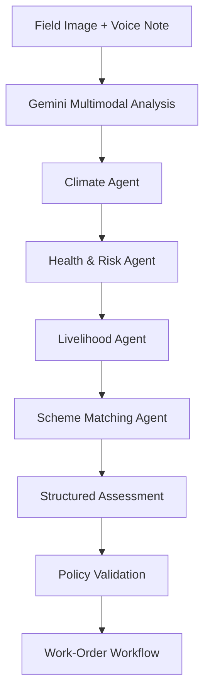
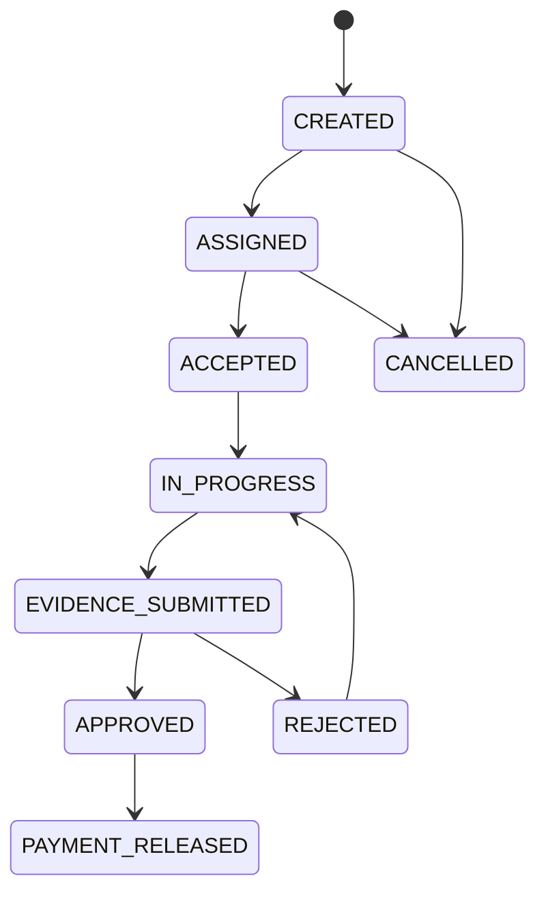
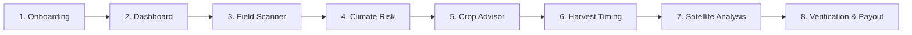

# 🌾 AetherWave — Climate Resilience & Agricultural Intelligence

<div align="center">
  

**AI-powered agricultural intelligence, climate-risk assessment, and verifiable work-order management.**

Empowering farmers and local response teams with field-level insights, evidence-based assessments, and transparent digital workflows.

  <br />

  
  
  
  
  
  
  
</div>

---

## 📖 Table of Contents

* [Overview](#-overview)
* [The Problem](#-the-problem)
* [Our Solution](#-our-solution)
* [Core Features](#-core-features)
* [System Architecture](#-system-architecture)
* [AI Agent Pipeline](#-ai-agent-pipeline)
* [Earth Observation & Climate Intelligence](#-earth-observation--climate-intelligence)
* [Evidence Verification & Blockchain](#-evidence-verification--blockchain)
* [Contractor & Work-Order Lifecycle](#-contractor--work-order-lifecycle)
* [3D Interactive Experience](#-3d-interactive-experience)
* [User Journey](#-user-journey)
* [Technology Stack](#-technology-stack)
* [Getting Started](#-getting-started)
* [Environment Variables](#-environment-variables)
* [Project Structure](#-project-structure)
* [API Overview](#-api-overview)
* [Security & Privacy](#-security--privacy)
* [Development Roadmap](#-development-roadmap)
* [Contributing](#-contributing)
* [License](#-license)

---

## 🌍 Overview

**AetherWave** is a climate-resilience and agricultural intelligence platform designed to help smallholder farmers understand environmental risks, assess field conditions, and connect agricultural needs with actionable interventions.

The platform combines multimodal AI, weather intelligence, earth-observation data, geospatial visualization, and blockchain-based verification to support a transparent agricultural assistance workflow.

AetherWave is designed around three goals:

1. **Anticipate risk:** Help users understand potential climate and crop-related threats using available environmental data.
2. **Support decisions:** Provide field assessments, agricultural recommendations, and risk-aware work-order workflows.
3. **Improve accountability:** Link evidence, approvals, and payment milestones to verifiable records and blockchain transactions.

The platform is being developed with an emphasis on accessibility, privacy, and resilience in rural environments.

> **Project status:** AetherWave is under active development. The availability and verification status of individual integrations—including satellite data, AI analysis, compressed state, and escrow transactions—must be confirmed against the deployed implementation. A visualization or simulated response does not by itself establish that a real-world integration is operational.

---

## 🚨 The Problem

Agricultural communities face interconnected challenges that can threaten crop productivity and household income.

### Climate-related risks

* Heavy rainfall and flooding can damage crops and disrupt agricultural operations.
* Extreme heat can affect crop growth, soil moisture, and labor conditions.
* Waterlogging and poor drainage can damage root systems.
* Delayed sowing or harvesting can increase exposure to adverse weather.

### Information gaps

* Farmers may lack access to timely, location-specific agricultural information.
* Field assessments can be difficult to coordinate across large areas.
* Satellite imagery and weather data can be challenging to interpret without specialized tools.
* Agricultural assistance programs can involve complex documentation and verification.

### Trust and accountability

* Field interventions require evidence that work was performed.
* Contractors and reviewers need a clear record of work-order status.
* Payment processes need transparent approval rules and verifiable transaction records.

AetherWave aims to address these challenges through a unified digital workflow.

---

## 💡 Our Solution

AetherWave brings together field-level intelligence and verifiable intervention management.

<div align="center">
  
</div>

### The end-to-end workflow

```text
Field Observation
       ↓
AI-Assisted Assessment
       ↓
Weather & Satellite Context
       ↓
Risk Analysis and Recommendations
       ↓
Contractor Matching
       ↓
Work-Order Creation
       ↓
Evidence Submission
       ↓
Verification and Approval
       ↓
Solana-Based Escrow Settlement
       ↓
Verifiable Completion Record
```

The platform separates AI-generated recommendations from authorization and payment decisions. Blockchain transactions are used for supported state changes and verification—not as a substitute for physical field inspection or independent evidence review.

---

## ✨ Core Features

### 1. Bhu-Drishti AI — Field Intelligence

A multimodal field-scanning experience designed to help users interpret agricultural observations.

* Image-based crop and soil assessment.
* Voice-assisted field reporting.
* Crop-condition and maturity analysis.
* Agricultural recommendations based on available context.
* Structured assessment reports for downstream workflows.

**AI outputs are advisory.** They should include uncertainty and must not be treated as definitive proof of crop damage, physical presence, or eligibility for compensation.

### 2. Climate Risk Intelligence

Weather-informed risk assessment using geographic coordinates and external meteorological data.

* Location-based weather information.
* Rainfall and temperature monitoring.
* Potential flood and heat-risk indicators.
* Agricultural advisories based on available forecasts.
* Sowing and harvesting decision support.

Forecasts and risk estimates depend on data availability, geographic coverage, and validated models.

### 3. Earth Observation & Satellite Intelligence

A geospatial analysis layer designed to incorporate satellite-derived information.

* Vegetation-condition monitoring.
* NDVI and NDWI visualization.
* Before-and-after imagery comparison.
* Potential flood and waterlogging indicators.
* Field-level environmental context.

Supported satellite sources and processing capabilities depend on the imagery and data services actually configured.

### 4. Contractor Management

A structured workflow for coordinating agricultural interventions.

* Contractor registration.
* Contractor assignment and acceptance.
* Work-order lifecycle tracking.
* Evidence submission.
* Review and approval.
* Payment status and completion records.

### 5. Solana-Based Verification

A blockchain layer for supported work-order and payment operations.

* Work-order state management.
* Escrow funding and release.
* Evidence-hash commitments.
* On-chain transaction verification.
* Completion attestations.
* Compressed-state integration where supported.

### 6. Interactive 3D Dashboard

A visual interface for exploring agricultural conditions and system activity.

* Interactive globe and satellite visualizations.
* Weather and risk displays.
* Field-parcel visualizations.
* Harvest and profitability views.
* Cryptographic verification interface.

---

## 🏗️ System Architecture

<div align="center">
  
</div>

AetherWave is organized into four logical layers.

### Layer 1 — Client & Field Capture

Responsible for user interaction and field data collection.

* Next.js and React frontend.
* Browser-based geolocation.
* Camera and image upload.
* Voice-note capture.
* Offline-capable interface where supported.
* Client-side integrity checks.

**Security note:** Browser geolocation, device orientation, timestamps, and client-side hashes are not hardware-backed proof of physical presence or authentic capture.

### Layer 2 — AI & Environmental Intelligence

Responsible for transforming submitted observations into structured assessments.

* Gemini multimodal analysis.
* Multi-agent orchestration.
* Weather data integration.
* Satellite data processing.
* Risk analysis and recommendation generation.
* Contractor and intervention matching.

### Layer 3 — Backend & Verification

Responsible for coordinating application workflows.

* Node.js and TypeScript API.
* Request validation and authorization.
* Work-order lifecycle management.
* Evidence processing and hashing.
* Policy validation.
* Transaction construction and verification.
* Notification and integration services.

### Layer 4 — Solana & Cryptographic Infrastructure

Responsible for blockchain-backed state and supported verification operations.

* Solana programs built with Anchor.
* Escrow account management.
* Work-order state transitions.
* Evidence commitments.
* Light Protocol compressed-state integration.
* Attestation and proof verification.

The blockchain records supported claims and transactions. It does not independently establish that a crop was damaged or that physical work was completed.

---

## 🤖 AI Agent Pipeline

AetherWave uses a multi-agent architecture to organize agricultural assessment and recommendation tasks.

<div align="center">
  
</div>

### Pipeline



### Agent responsibilities

| Agent                       | Responsibility                                                          |
| --------------------------- | ----------------------------------------------------------------------- |
| **Field Analysis Agent**    | Extracts structured observations from images and descriptions.          |
| **Climate Agent**           | Retrieves and interprets relevant weather information.                  |
| **Health & Risk Agent**     | Evaluates potential crop or environmental risks using available inputs. |
| **Livelihood Agent**        | Organizes estimated agricultural impact and intervention needs.         |
| **Scheme Matching Agent**   | Matches cases against configured assistance-program information.        |
| **Policy Validation Layer** | Applies explicit rules to determine whether a workflow can proceed.     |

Agents are software components coordinated through a shared workflow. Their outputs are not independent proof, and AI-generated confidence scores must not be treated as calibrated probabilities without validation.

---

## 🛰️ Earth Observation & Climate Intelligence

AetherWave is designed to combine meteorological information and satellite-derived observations to support agricultural monitoring.

### Satellite data sources

<div align="center">
  
</div>

| Data source                         | Intended application                                                           |
| ----------------------------------- | ------------------------------------------------------------------------------ |
| **RISAT / SAR imagery**             | Radar-based observation that can provide useful information under cloud cover. |
| **Sentinel-2 MSI**                  | Multispectral vegetation and land-surface analysis.                            |
| **Cartosat-derived elevation data** | Terrain and drainage-context analysis where suitable data is available.        |

Satellite data availability, acquisition dates, spatial resolution, processing requirements, and licensing must be verified for each deployment.

### Vegetation indices

**Normalized Difference Vegetation Index (NDVI)**

$$
NDVI = \frac{NIR - Red}{NIR + Red}
$$

NDVI can help characterize vegetation greenness and relative vegetation condition.

**Normalized Difference Water Index (NDWI)**

The specific NDWI formulation depends on the selected spectral bands. A commonly used formulation is:

$$
NDWI = \frac{Green - NIR}{Green + NIR}
$$

These indices are useful indicators but are not definitive crop-damage measurements.

### Radar-based monitoring

<div align="center">
  
</div>

Synthetic Aperture Radar (SAR) uses microwave backscatter to observe surface characteristics.

Potential applications include:

* Flood and inundation mapping.
* Surface-moisture-related analysis.
* Change detection across observation dates.
* Complementary monitoring when optical imagery is obscured by clouds.

Radar interpretation depends on acquisition geometry, polarization, surface roughness, vegetation structure, and processing methodology.

<div align="center">
  
</div>

### Bitemporal change detection

<div align="center">
  
</div>

AetherWave's intended change-detection workflow compares observations from two time periods to identify potential changes in field conditions.

```text
Pre-Event Observation
        ↓
Post-Event Observation
        ↓
Preprocessing & Alignment
        ↓
Change Detection
        ↓
Affected-Area Estimation
        ↓
Review and Interpretation
```

A change in satellite signal or vegetation index is an indicator requiring contextual interpretation, not automatic proof of crop loss.

---

## 🔐 Evidence Verification & Blockchain

AetherWave uses cryptographic techniques to support evidence integrity and transparent workflow verification.

### Evidence hashing

Uploaded evidence can be hashed using SHA-256.

```text
Evidence File
     ↓
SHA-256 Hash
     ↓
Evidence Commitment
     ↓
Blockchain Transaction
     ↓
Independent Integrity Verification
```

A matching hash indicates that the compared file bytes are identical. It does not establish when, where, or how the evidence was captured.

### Solana verification layer

<div align="center">
  
</div>

The Solana integration is intended to support:

* Work-order state transitions.
* Escrow funding and release.
* Evidence-hash commitments.
* Transaction-signature verification.
* Completion attestations.
* Compressed-state records where supported.

### Light Protocol & ZK Compression

Light Protocol integration is intended to reduce the cost of managing supported compressed state.

Potential applications include:

* Compressed credential records.
* Compressed completion commitments.
* Verifiable state updates using supported proof mechanisms.

Compressed state and ordinary Solana accounts have different access and update models. Escrow balances and privileged authorization should remain governed by appropriately designed on-chain program logic.

### Zero-knowledge proofs

Zero-knowledge proofs may support selected privacy-preserving verification requirements.

Potential use cases include proving a defined property without exposing the underlying private input.

A zero-knowledge proof does not automatically make all application data private. Each proof requires an appropriate statement, circuit, public inputs, and verification mechanism.

---

## 🧾 Contractor & Work-Order Lifecycle

The work-order system connects an agricultural assessment with an intervention and its completion evidence.

### Lifecycle



Actual permitted transitions depend on the deployed program and backend validation rules.

### Work-order process

1. A field assessment is submitted.
2. The backend generates a structured assessment.
3. A work order is created for an approved intervention.
4. An eligible contractor is assigned.
5. The contractor accepts and performs the work.
6. Completion evidence is uploaded.
7. An authorized reviewer evaluates the evidence.
8. Approval triggers the configured payment workflow.
9. The resulting transaction and completion record can be independently verified.

### Escrow and payment

The intended payment workflow is:

```text
Escrow Funding
      ↓
Work Completion
      ↓
Evidence Review
      ↓
Authorized Approval
      ↓
Program-Enforced Release
      ↓
On-Chain Confirmation
```

The smart contract must enforce authorization, funding, release conditions, and duplicate-payment protection.

Bank or UPI payouts require a separate payment integration and must not be represented as automatic Solana transfers unless that integration actually exists.

---

## 🌐 Interactive 3D Experience

AetherWave uses Three.js and WebGL to present complex agricultural and environmental information through interactive visualizations.

| Component                | Route                | Purpose                                                             |
| ------------------------ | -------------------- | ------------------------------------------------------------------- |
| `OrbitalEarth3D`         | `/satellite`         | Interactive globe and satellite-orbit visualization.                |
| `DisasterRadarDome3D`    | `/weather`           | Weather and hazard visualization.                                   |
| `FieldParcelVoxel3D`     | `/crop-advisor`      | Three-dimensional agricultural parcel and soil-layer visualization. |
| `HarvestYieldTimeline3D` | `/harvest-timing`    | Harvest timing and financial comparison interface.                  |
| `SolanaZkVault3D`        | `/payout`            | Cryptographic verification and transaction-status visualization.    |
| `VerificationSeal3D`     | `/verification/seal` | Visual representation of a verification record.                     |

These components are visualization interfaces. Any live telemetry, scientific simulation, or blockchain data displayed must be connected to a verified source.

---

## 📷 Bhu-Drishti AI — भू-दृष्टि विज़न

The field-scanning interface is designed to help users capture observations and receive AI-assisted agricultural insights.

<div align="center">
  
</div>

### Field & Soil Mode

Potential outputs include:

* Soil and field observations.
* Agricultural preparation recommendations.
* Estimated seed requirements.
* Input-cost estimates.
* Crop-planning suggestions.

### Crop Assessment Mode

Potential outputs include:

* Visible crop-condition observations.
* Estimated maturity indicators.
* Harvest-planning recommendations.
* Yield estimates when suitable data is available.
* Market-value estimates when current price data is available.

### Evidence workflow

The scanner can submit an observation to the backend for analysis and evidence processing.

A browser-based camera interface alone does not provide hardware-backed capture attestation. Any claim of secure device attestation requires a supported implementation and verification mechanism.

---

## 🌦️ Real-Time GPS & Climate Intelligence

The weather interface is designed to use browser geolocation and external meteorological data to provide location-specific information.

### Weather intelligence

* Current and forecast weather information.
* Precipitation and temperature trends.
* Potential flood-risk indicators.
* Heat-risk indicators.
* Wind-related hazard information.

### Agricultural decision support

**Sowing decisions**

* Compare available weather conditions against crop-specific requirements.
* Identify potentially unfavorable sowing windows.
* Estimate input costs using configured assumptions.

**Harvest decisions**

* Compare harvest timing against available weather forecasts.
* Highlight potential rain-related risks.
* Present estimated financial outcomes using explicit assumptions.

### Notifications

The frontend can provide:

* WhatsApp deep links.
* Native SMS links.
* Local notifications where supported.
* Backend-triggered notifications through an integrated messaging provider.

Forecast probabilities and financial estimates require validated models, current input data, and transparent assumptions. A generic weather API does not by itself provide calibrated 30-day disaster probabilities.

---

## 📱 8-Screen User Journey



| Screen                    | Route                   | Description                                                     |
| ------------------------- | ----------------------- | --------------------------------------------------------------- |
| **Onboarding**            | `/onboarding`           | Language selection and user onboarding.                         |
| **Dashboard**             | `/dashboard`            | Agricultural overview, risk indicators, and workflow status.    |
| **Field Scanner**         | `/verification/capture` | Image and voice-based field observation.                        |
| **Climate Risk**          | `/weather`              | Weather information and hazard indicators.                      |
| **Crop Advisor**          | `/crop-advisor`         | Agricultural planning and input estimates.                      |
| **Harvest Timing**        | `/harvest-timing`       | Harvest decision support and risk comparison.                   |
| **Satellite Analysis**    | `/satellite`            | Satellite imagery and geospatial visualization.                 |
| **Verification & Payout** | `/payout`               | Evidence verification, payment status, and transaction records. |

Language support is intended to include Hindi, English, Bengali, Marathi, Telugu, Punjabi, Gujarati, Tamil, and Kannada, subject to the available translations and voice services.

---

## 🧰 Technology Stack

<table>
  <thead>
    <tr>
      <th align="left">Layer</th>
      <th align="left">Technology</th>
      <th align="left">Purpose</th>
    </tr>
  </thead>
  <tbody>
    <tr>
      <td><b>Frontend</b></td>
      <td>Next.js 15.5, React 19, TypeScript 5.8</td>
      <td>Application interface and routing.</td>
    </tr>
    <tr>
      <td><b>Styling</b></td>
      <td>Tailwind CSS v4</td>
      <td>Responsive UI and design system.</td>
    </tr>
    <tr>
      <td><b>3D Graphics</b></td>
      <td>Three.js, WebGL</td>
      <td>Interactive geospatial and scientific visualizations.</td>
    </tr>
    <tr>
      <td><b>Backend</b></td>
      <td>Node.js, Express, TypeScript</td>
      <td>API orchestration, validation, and workflow management.</td>
    </tr>
    <tr>
      <td><b>AI</b></td>
      <td>Google Gemini, LangGraph</td>
      <td>Multimodal analysis and agent orchestration.</td>
    </tr>
    <tr>
      <td><b>Blockchain</b></td>
      <td>Solana, Anchor</td>
      <td>On-chain state, escrow, and verification.</td>
    </tr>
    <tr>
      <td><b>Compressed State</b></td>
      <td>Light Protocol / ZK Compression</td>
      <td>Supported compressed-state operations.</td>
    </tr>
    <tr>
      <td><b>Earth Observation</b></td>
      <td>Sentinel-2, SAR data sources</td>
      <td>Vegetation, land-surface, and change analysis.</td>
    </tr>
    <tr>
      <td><b>Weather</b></td>
      <td>Open-Meteo</td>
      <td>Weather and forecast data.</td>
    </tr>
    <tr>
      <td><b>Voice</b></td>
      <td>ElevenLabs (planned/integrated as configured)</td>
      <td>Speech generation and accessibility.</td>
    </tr>
    <tr>
      <td><b>Offline Support</b></td>
      <td>PWA, Service Worker, Workbox, Zustand</td>
      <td>Offline interface and supported local state.</td>
    </tr>
    <tr>
      <td><b>Notifications</b></td>
      <td>Twilio or supported messaging integrations</td>
      <td>Work-order and status notifications.</td>
    </tr>
  </tbody>
</table>

---

## 🚀 Getting Started

### Prerequisites

* Node.js 20.x or another version supported by the project dependencies.
* npm.
* Git.
* A Solana Devnet wallet for blockchain development.
* API credentials for any external services you intend to enable.

### 1. Clone the repository

```bash
git clone https://github.com/Ayushnot41/AetherWave.git
cd AetherWave
```

### 2. Install dependencies

```bash
npm install
```

### 3. Configure environment variables

```bash
cp .env.example .env.local
```

Fill in the environment variables required by your local configuration.

### 4. Start the development server

```bash
npm run dev
```

Open:

http://localhost:3000

> If your project uses a separate backend service, start it using the backend's documented development command as well.

---

## 🔑 Environment Variables

Create a `.env.local` file using `.env.example` as the reference.

Example configuration:

```dotenv
# Application
NEXT_PUBLIC_APP_URL=http://localhost:3000

# AI
GEMINI_API_KEY=

# Weather
OPEN_METEO_BASE_URL=https://api.open-meteo.com/v1

# Solana
SOLANA_RPC_URL=https://api.devnet.solana.com
SOLANA_NETWORK=devnet
SOLANA_PROGRAM_ID=

# Authentication
AUTH0_DOMAIN=
AUTH0_CLIENT_ID=
AUTH0_CLIENT_SECRET=

# Notifications
TWILIO_ACCOUNT_SID=
TWILIO_AUTH_TOKEN=
TWILIO_PHONE_NUMBER=
```

Only configure variables used by the actual implementation. Keep private keys and secrets on the server and never expose them through `NEXT_PUBLIC_` variables.

---

## 📂 Project Structure

The following is a suggested logical structure. Update it to match the actual repository layout.

```text
AetherWave/
├── public/
│   ├── assets/
│   │   ├── architecture_3d_pipeline.svg
│   │   ├── earth_3d_orbit_constellation.svg
│   │   ├── multi_agent_got_council.svg
│   │   ├── sar_radar_physics_spectrum.svg
│   │   └── temporal_bitemporal_3d_cockpit.svg
│   └── images/
├── src/
│   ├── app/
│   ├── components/
│   ├── features/
│   ├── lib/
│   └── types/
├── apps/
│   └── server/
│       └── src/
│           ├── routes/
│           ├── controllers/
│           ├── services/
│           ├── agents/
│           ├── blockchain/
│           └── security/
├── programs/
│   └── aetherwave/
├── docs/
├── tests/
├── .env.example
├── package.json
└── README.md
```

---

## 🔌 API Overview

The backend exposes versioned API endpoints for field assessment, contractor management, evidence verification, and payment workflows.

| Method | Endpoint                           | Purpose                                                      |
| ------ | ---------------------------------- | ------------------------------------------------------------ |
| `POST` | `/api/v1/analyze`                  | Submit a field assessment for AI analysis.                   |
| `POST` | `/api/v1/contractors/register`     | Register a contractor.                                       |
| `POST` | `/api/v1/work-orders`              | Create a work order.                                         |
| `POST` | `/api/v1/work-orders/:id/assign`   | Assign a contractor.                                         |
| `POST` | `/api/v1/work-orders/:id/accept`   | Accept a work order.                                         |
| `POST` | `/api/v1/work-orders/:id/start`    | Mark work as started.                                        |
| `POST` | `/api/v1/work-orders/:id/evidence` | Submit completion evidence.                                  |
| `POST` | `/api/v1/work-orders/:id/approve`  | Approve a work order.                                        |
| `POST` | `/api/v1/work-orders/:id/release`  | Request or execute escrow release, subject to authorization. |

The exact request and response schemas should be documented alongside the implemented API routes.

---

## 🛡️ Security & Privacy

AetherWave is designed to minimize unnecessary exposure of sensitive agricultural and identity data.

### Data protection principles

* Keep private evidence files in access-controlled storage.
* Avoid publishing personal identities and exact field coordinates unnecessarily.
* Validate authentication and authorization on every protected operation.
* Keep signing keys and API secrets outside client-side code.
* Verify transaction signatures and actual on-chain state.
* Apply strict access controls to contractor and reviewer operations.
* Record relevant workflow events for auditability.

### Integrity vs. authenticity

A cryptographic hash can help establish that a file has not changed since hashing.

It does not prove that:

* The file was captured at the claimed location.
* The image depicts the claimed field.
* The work was physically completed.
* The device was uncompromised.
* The submitted claim is factually correct.

These claims require additional evidence and appropriate verification procedures.

### Financial safety

* Escrow release must be enforced by the smart contract.
* The backend must verify actual transaction confirmation.
* Duplicate releases must be prevented.
* Dispute and refund conditions must be explicitly defined.
* AI recommendations must not independently authorize financial transfers.

---

## 🗺️ Development Roadmap

The following roadmap describes intended capabilities, not a claim that every item is already implemented.

* [ ] Complete the field-assessment API and structured AI outputs.
* [ ] Integrate weather data and environmental context.
* [ ] Implement contractor registration and matching.
* [ ] Complete the on-chain work-order lifecycle.
* [ ] Implement and test escrow funding and release on Devnet.
* [ ] Add evidence commitments and verification.
* [ ] Integrate supported Light Protocol compressed-state operations.
* [ ] Implement completion attestations.
* [ ] Add privacy-preserving proof verification for selected claims.
* [ ] Improve offline synchronization and notification workflows.
* [ ] Validate geospatial analysis and satellite-data pipelines.
* [ ] Complete end-to-end testing and deployment documentation.

---

## 🤝 Contributing

Contributions are welcome.

1. Fork the repository.
2. Create a feature branch.
3. Make your changes.
4. Run the relevant tests.
5. Submit a pull request with a clear description of the change.

For major changes, open an issue first to discuss the proposed implementation.

---

## 📄 License

This project is licensed under the **MIT License**. See the [LICENSE](LICENSE) file for details.

---

<div align="center">

**AetherWave — Building a more resilient and transparent agricultural future.**

*Climate Intelligence · Agricultural Support · Verifiable Workflows*

</div>
